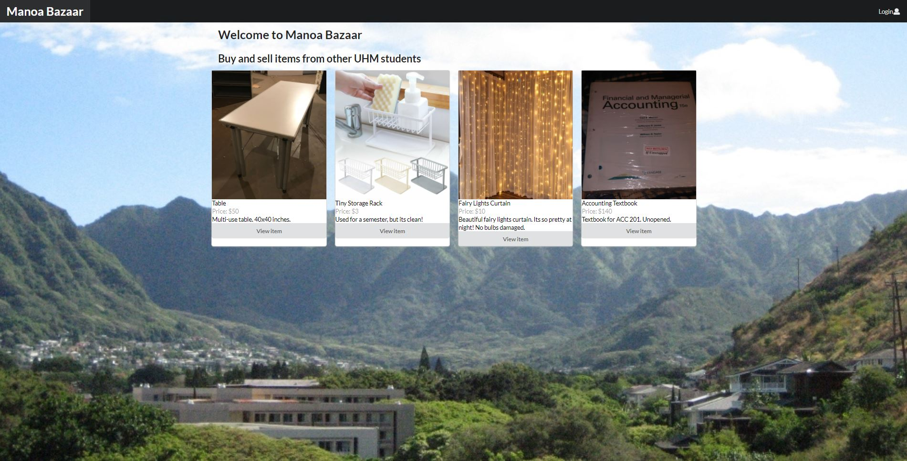
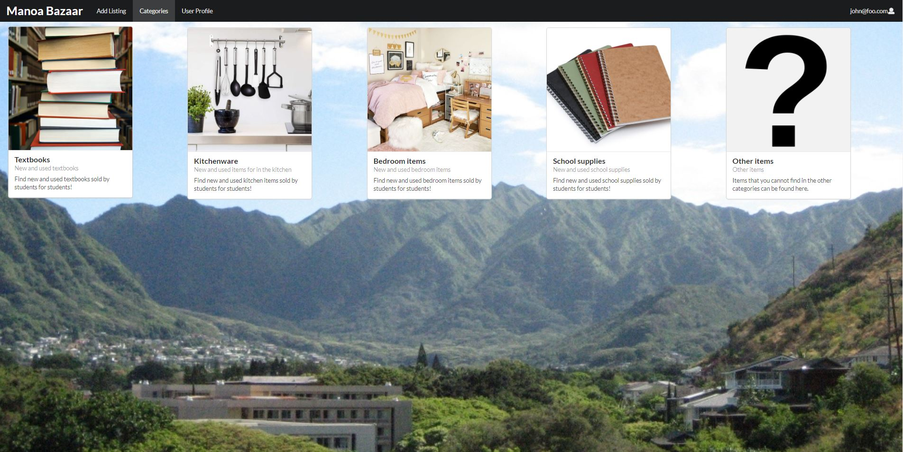
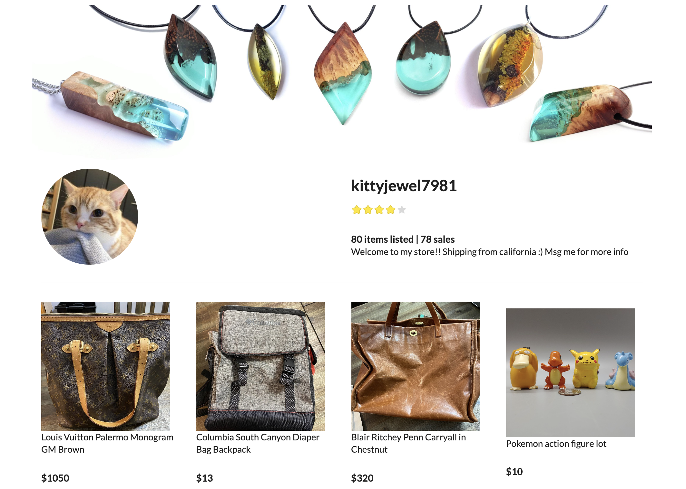

## Overview

The purpose of this project is to provide students at UH Manoa with a website that allows them to buy and sell goods easily within the community. Many goods that students purchase when going to college have high turnover rates. The problem with these are that they are usually difficult to sell quickly as usually only other students are willing to buy them. When buying or selling such items through a global platform such as Ebay or Facebook, students have to worry about shipping costs, delivery time, and scams. The use of a local application can reduce or eliminate many of these concerns.

**You must log in to see the following pages.** 
This is the [landing page](https://manoabazaar.com/#/). It displays ranmoized items that are currently being sold

This is categories listing that shows various categories of items being sold.

When you click on any of the categories it will display all items that are currently being sold that are related to the category.

The user profile displays the user's profile along with their shop description and other information and their items being listed.

