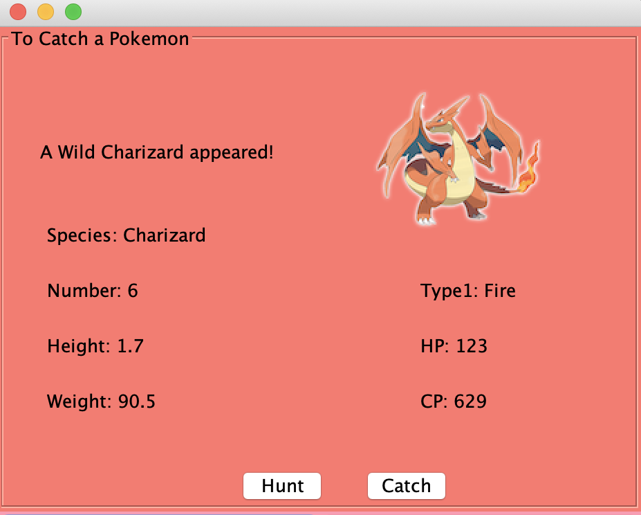
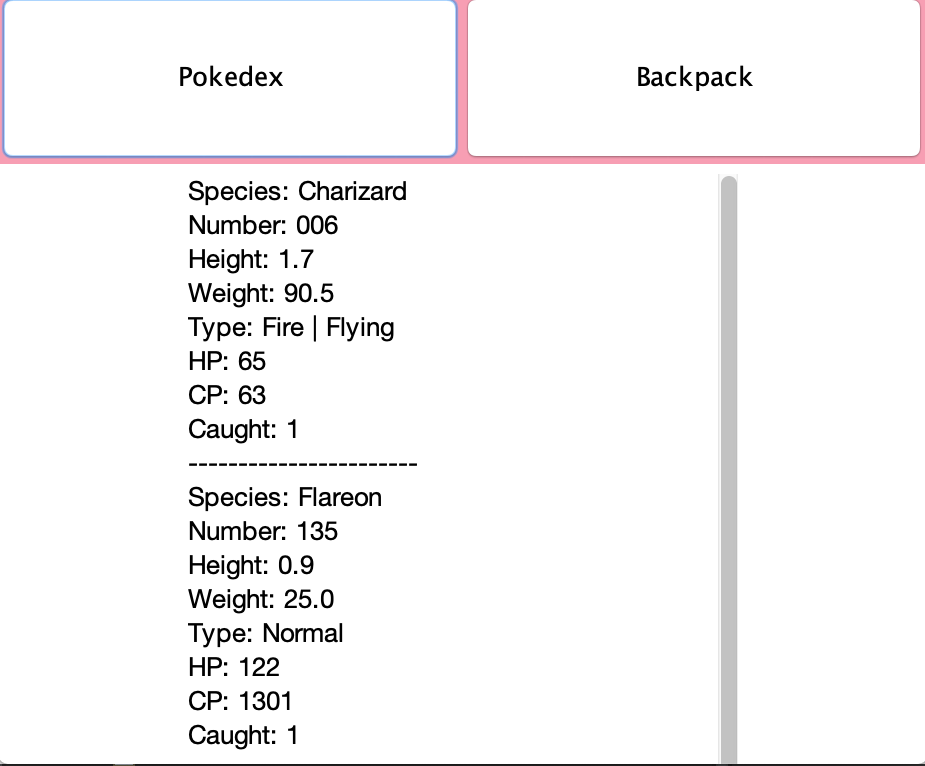

  

This is a Pokemon imspired application that I helped create with my group in ICS 211 in Spring 2020. This project helped me learn how to create and implement GUIs and utilized the data structures that we learned previously. My role in this project was to create the GUI using Java JFrames and JPanels while helping my team members with the Stack and PriorityQueue used to store the caught Pokemon.  

For this project, we created a program that allows the user to search for and catch pokemon. When the user clicks the "Hunt" button, the program would randomly selevt a species of Pokemon and create it. Text when then display "A (Pokemon's species) appeated!" When the user clicks the "Catch" button, the program would randomly decide if the Pokemon got caught. If caught, text area would display "(Pokemon species) was caught!" If not caught, the text area would inform the user that the Pokemon escaped. We also had a feature that lets you look at the stats of the Pokemon that you come across through the pokedex and look at the ones you've already caught through your backpack. 

