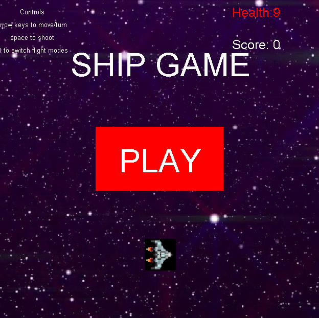

This is a simple game that I created with my group in ICS 111. It is very similar to the game Galaga where you pilot a ship and shoot missiles at incoming enemy ships. In Galaga, the enemy ships spawn from the top of the screen and go down towards the player at the bottom. In our version, enemy ships spawn from all sides so you must be weary of hugging the edges fo the screen. We also implimented multidirectional movement so the ship is not confined to the four directionals(forward, back, left, right)

My role for this project was to write the code for the enemy ship object, the asteroids, and program the both of their spawn rates. This accounted for one third of the project. The goal of this project was to use all of the programming knowledge we acquired throughout the course with emphasis on creating objects. This was my first group project in ICS and with it I got first hand experience with working with a team to meet a deadline for a project. I learned how to effectively divide the work between members and to communicate effectively to solve any problems I encountered. 

video demonstration: [video](https://youtu.be/xyPaUNSi7AY)
