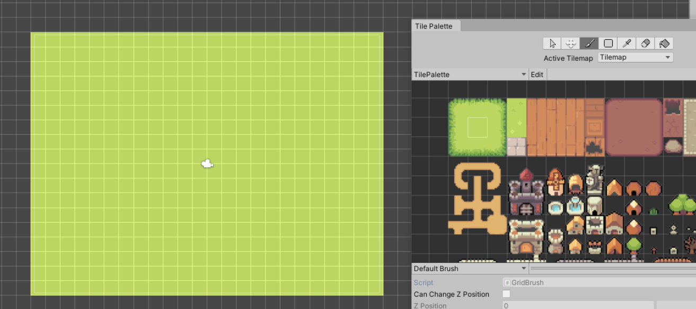

I am currently working on a project by myself to create a 2D RPG. I'm developing it with Unity and am using this project as a way to learn how to program in C# and to get familiar with using Unity. Here are some concept images and development pictures. I am using free assets for the buildings for now while I make my own art for them.

